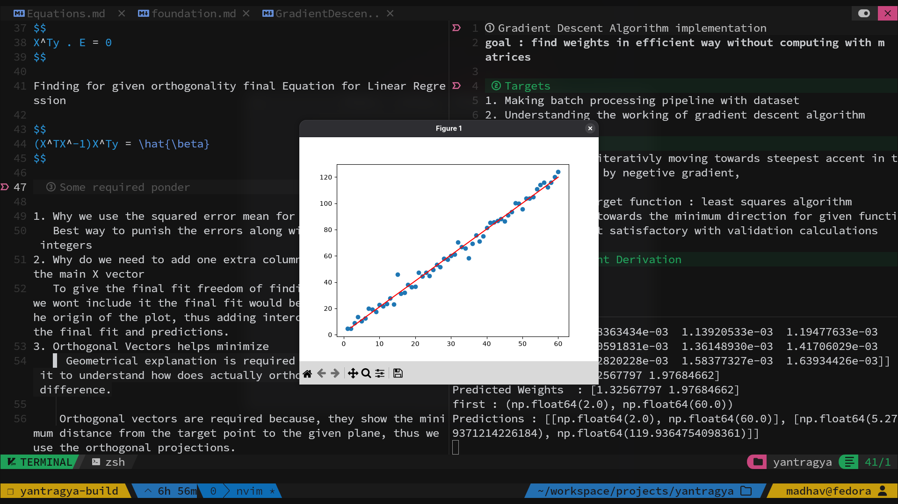

# yantragya v 0.1
Making simple Machine Learning Library to explore implementation of mathematics and programming into play.

## Key Features
1. Linear Regression Module
    + OLS
    + Gradient Descent

2. Utilities
    + Graph tool
    + file handler
3. testing suite
    + synthetic data generators
    + testing data repository
    + testing setup scripts



## Project structure and working
```
yantragya
.
├── development-log.md
├── docs
│   ├── Equations.md
│   └── linear-regression.md
├── experiments
│   ├── GausianElimination.py
│   └── ploting_test.py
├── NoteBooks
│   └── LinearRegressionTesting.ipynb
├── README.md
├── requirements.txt
├── src
│   ├── __init__.py
│   ├── LinearRegression
│   │   ├── __init__.py
│   │   └── OrdinaryLeastSquare.py
│   └── utility
│       ├── CsvLoader.py
│       ├── __init__.py
│       ├── __pycache__
│       │   ├── CsvLoader.cpython-312.pyc
│       │   ├── __init__.cpython-312.pyc
│       │   └── Vizion.cpython-312.pyc
│       └── Vizion.py
├── tests
│   ├── __init__.py
│   ├── test_data.csv
│   ├── test_data.py
│   └── test_least_square.py
└── todo.md

```
